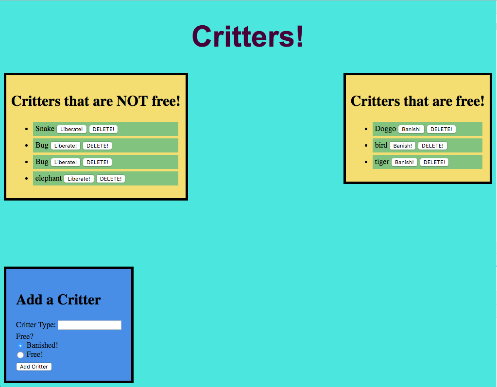

# Free The Critter

Free the Critter is a demonstration orm node full stack app that relies on handlebars framework, mysql to interact with a database, and express for server framework. When users visit the page, all current 'critters' (any animal) are displayed from the database in the appropriate block based on a boolean value of 'free' or 'not free' (t/f). The user is allowed to change the crtters state, and a sql command will be issued from the server, updating the database and reloading the page to update the handlebars framework.

The user can also delete and add critters. A delete button is assigned to each critter. 

New critters can be added through the form located at the bottom of the page with the input of critter type/name and its free status. 